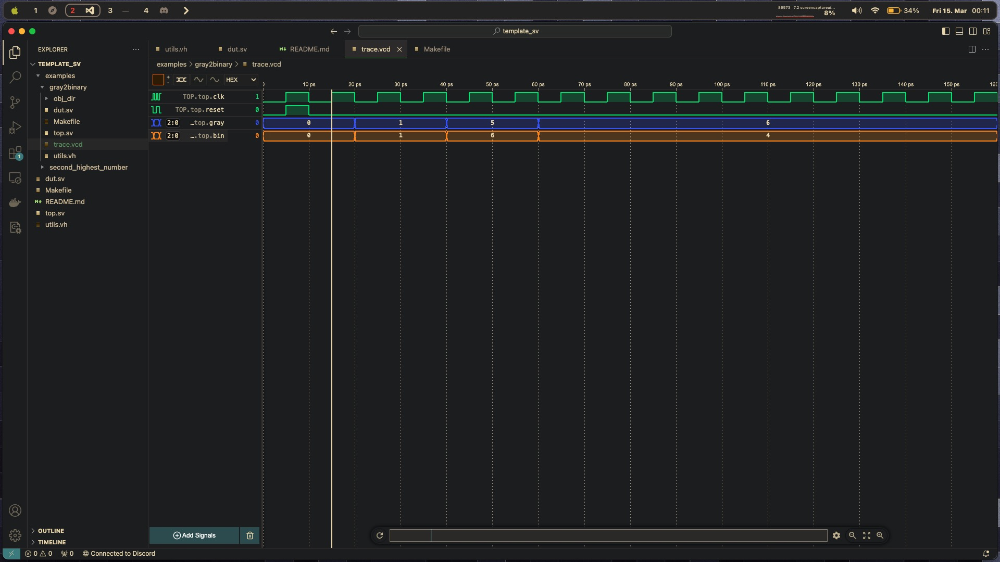

# Template for Simulating Designs using Verilator

This is a template that can be used to design an simulate RTL designs on your PC using the open-source verilog compiler [Verilator](https://www.veripool.org/verilator/).

## Installation

1. [Install verilator](https://verilator.org/guide/latest/install.html)
    - On Ubuntu: `apt-get install verilator`
    - On macOS: `brew install verilator` 
2. Install GTKWave to view waveforms generated by verilator tracing. Unfortunately, GTKWave is broken on macOS, but there's a great VSCode extension [wavetrace](https://www.wavetrace.io) that can be used as an alternative.

## Usage

1. Clone this repository
``` bash
git clone https://github.com/SantoshSrivatsan24/verilator_testbench.git
```

2. Run `make` to build the design. Verilator compiles SystemVerilog to C++ and creates an `obj_dir` directory.

3. `make run` to simulate the design. This will also create a `trace.vcd` file that you can view using GTKWave using `make waves`. If you
're using wavetrace instead, then simply clicking on the `trace.vcd` file should open the waveform in a new window.

